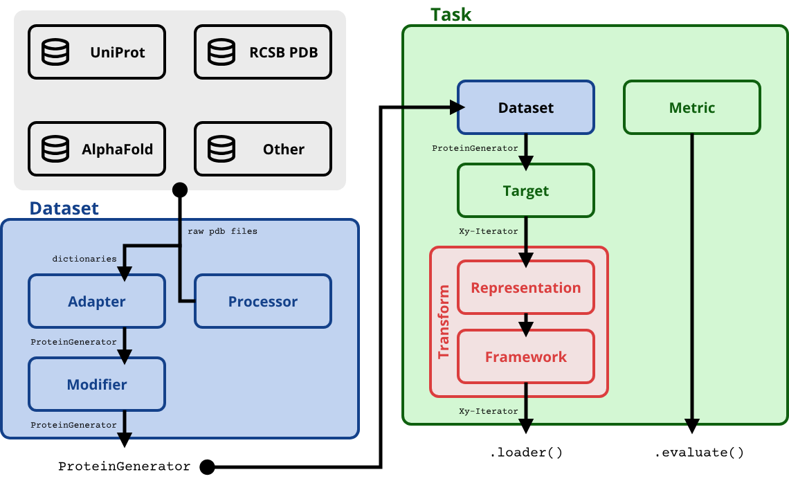

Developer guide
===============

ProteinShake provides a lot of flexibility out of the box, but if you want to dive in, you will find that every component of the library is customizable. Below is a sketch of the data processing pipeline, and instructions on how to create subclasses for each component.

Library architecture
--------------------

This is a diagram of how the classes of ProteinShake work together to define the data processing.

Preliminaries
-------------

The whole pipeline is implemented as a chain of transforms acting on iterator-type objects. This is done to reduce RAM usage, as datasets can grow quite large quite quickly.

The chain starts with a ``ProteinGenerator`` which is just a standard Python iterator of dictionaries. The dictionaries contain the protein data as key-value pairs (e.g. ID, sequence, coordinates, labels, quality scores). The ``ProteinGenerator`` can also store additional data in JSON format, for which it has ``assets`` and ``meta`` fields. This can be useful, for example, if you want to store pairwise data that does not fit into the iterator-format.

Internally, the ``ProteinGenerator`` is stored in Apache Avro format, an efficient row-wise file structure for big data applications. We also apply some optimizations to reduce disk usage.

Implement an adapter
---------------------

Adapters are the first line of defense and interact directly with the raw data sources such as UniProt or PDB.
Adapters must implement a ``.download()`` method which returns a ``ProteinGenerator``.

.. code:: python

    from proteinshake.adapter import Adapter

    class MyAdapter(Adapter):

        def download(self, *args, **kwargs) -> ProteinGenerator:
            pass

You are pretty free to do whatever it takes to download your data, as long as you provide a ``ProteinGenerator`` as a result. It can be constructed from an iterator of protein dicts. The protein dicts are generated by ``Processor`` which takes raw ``.pdb`` or ``.mmcif`` structure files. You can then amend the protein dicts with other annotations (potentially from another database), and also store additional data in the ``assets`` and ``meta`` fields.

Implement a modifier
---------------------

Once you have a ``ProteinGenerator`` you can modify it to compute splits, filter proteins, or add other annotations. As these might be re-used in different datasets, we provide a separate class for it called the ``Modifier``:

.. code:: python

    from proteinshake.modifier import Modifier

    class MyModifier(Modifier):

        def __call__(self, proteins: ProteinGenerator) -> ProteinGenerator:
            pass

They input and output a ``ProteinGenerator``, and can do all kinds of operations in between.

Implement a target
---------------------

Targets define a prediction problem and take a ``ProteinGenerator`` as an input. The output is another kind of iterator called the ``Xy-iterator``. It has a special structure which will become important in transforms.

.. code:: python

    from proteinshake.target import Target

    class MyTarget(Target):

        def __call__(self, dataset: ProteinGenerator) -> Iterator[Tuple[Tuple[Dict], Any]]:
            pass

Note the signature of the ``__call__`` function. The ``Xy-iterator`` is an iterator over tuples ``((X1, X2, X3, ...), y)`` where ``y`` is some prediction target (e.g. a scalar or vector), and ``(X1, X2, X3, ...)`` is a tuple of protein dictionaries. The latter can be a tuple with a single protein for most cases, but can contain more proteins for e.g. pairwise prediction problems or contrastive learning.

Implement a transform
---------------------

A transform takes an ``Xy-iterator`` and output an ``Xy-iterator``. There are some helper subclasses of ``Transform`` implemented in ``proteinshake.transform`` that reshape the ``Xy-iterator`` into something simpler for you, for example when you write a transform for single proteins or labels only.

Transforms can optionally be fitted on the training data, which the ``Task`` class will perform before applying the transforms.

Note also the ``stochastic`` class property. This is important if you implement non-deterministic transform, such as random masking or random rotations. The internal optimizations cannot be applied to those as they need to be re-computed at every iteration, and the ``stochastic`` flag tells ProteinShake whether to precompute and store these transforms.

.. code:: python

    from proteinshake.transform import Transform

    class MyTransform(Transform):
        stochastic = False

        def fit(self, Xy):
            pass

        def transform(self, Xy):
            pass

Implement a representation
---------------------

A representation is a special instance of a transform. Subclass it with the ``Representation`` mixin:

.. code:: python

    from proteinshake.representation import Representation
    from proteinshake.transforms import DataTransform

    class MyRepresentation(Representation, DataTransform):
        def transform(self, X):
            pass

Typically you would inherit from ``DataTransform`` here, as a representation deals with single protein dicts.

Implement a framework
---------------------

Also framworks are special instances of transforms. They additionally implement a ``.create_dataloader()`` method, which takes an ``Xy-iterator`` and returns an iterator-type data loader of the respective framework.

.. code:: python

    from proteinshake.framework import Framework
    from proteinshake.transforms import DataTransform

    class MyFramework(Framework, DataTransform):
        def transform(self, X):
            pass

        def create_loader(self, iterator, **kwargs):
            pass

Mocks
-----

For testing purposes we implemented mocks for some objects like adapters, proteins, and iterators. Have a look at the documentation and see if there is anything useful for you!